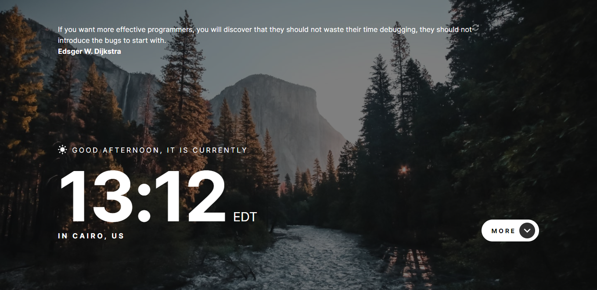
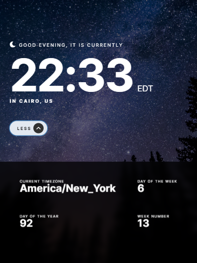
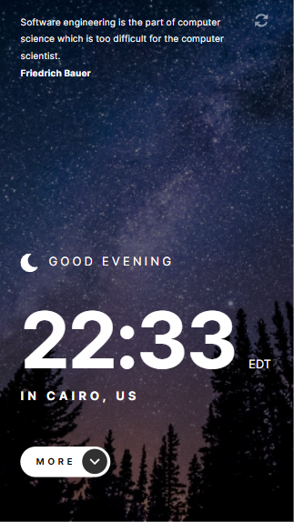

# Frontend Mentor - Clock app solution

This is a solution to the [Clock app challenge on Frontend Mentor](https://www.frontendmentor.io/challenges/clock-app-LMFaxFwrM). Frontend Mentor challenges help you improve your coding skills by building realistic projects. 

## Table of contents

- [Overview](#overview)
  - [The challenge](#the-challenge)
  - [Screenshot](#screenshot)
  - [Links](#links)
- [My process](#my-process)
  - [Built with](#built-with)
  - [Continued development](#continued-development)
  - [Useful resources](#useful-resources)
- [Author](#author)

**Note: Delete this note and update the table of contents based on what sections you keep.**

## Overview

### The challenge

Users should be able to:

- View the optimal layout for the site depending on their device's screen size
- See hover states for all interactive elements on the page
- View the current time and location information based on their IP address
- View additional information about the date and time in the expanded state
- Be shown the correct greeting and background image based on the time of day they're visiting the site
- Generate random programming quotes by clicking the refresh icon near the quote

### Screenshot

### Links

- Live Site URL: [Vercel](https://clock-app-coral.vercel.app/)

## My process

### Built with

- [React](https://reactjs.org/) - JS library
- [Chakra UI](https://chakra-ui.com/) -Frontend Framework
- Typescript
- Flexbox
- Mobile-first workflow

### Continued development
I want to continue to get better with Typescript and learn other Frontend Libraries. I also want to delve in the world of state mangagement.

### Useful resources

- [How to control the size of fixed positioned items](https://stackoverflow.com/questions/39995249/is-it-possible-to-make-a-fixed-position-div-responsive) -  This StackOverflow post helped me understand how to use fixed positioned items in my code.
- [Understanding Datetime](https://www.toptal.com/software/definitive-guide-to-datetime-manipulation) - This is an amazing article which helped me finally understand Datetime in JS. I'd recommend it to anyone still learning this concept.
- [Converting Time]( https://www.tutorialspoint.com/converting-12-hour-format-time-to-24-hour-format-in-javascript) 

## Author

- Website - [Rodderick Garland](https://www.rodthedev.com)

